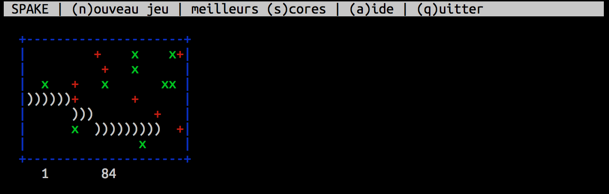

# Spake

A small game, originally written by [Guillaume](https://github.com/guillaumesalagnac)
for a TI-89, ported from a code for Casio calculators.

This next port is done (well, was done, in 2005) in C, using
[ncurses](http://www.gnu.org/software/ncurses/).



To build and run the game, make sure you have the dev ncurses libs, and just type:

```sh
make run
```